# linux-fundamentals

**File System Navigation**

* List the contents of the home directory.  
  ```bash
    # List all the contents
    ls
    # List all the contents with dot(.) items
    ls -a
    # List all the contents with file permissions and others details informations
    ls -l
    # List all the contents with file permissions and others details informations also with dot(.) items
    ls -la
  ```
  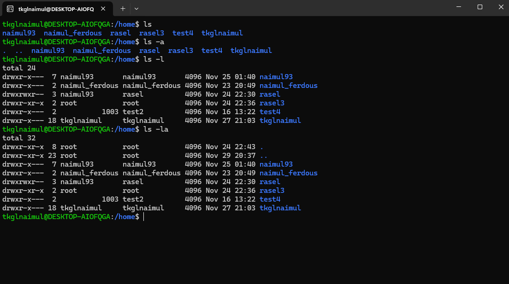

* Change the current directory to **/var/log** and list its contents.
  
  ```bash
    # Moves to the root(/) directory
    cd /
    # Moves to the current users directory inside home directory
    cd
    # Moves to the previous directory
    cd - 
    # Moves up one directory level
    cd ..
    # Moves to the given path directory. Do not forget the forward slash(/) at the beginning
    cd /var/log
    # List the items in the directory
    ls
  ```
  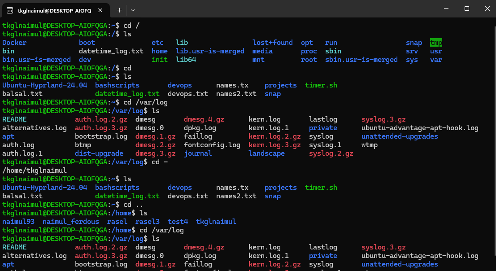
  
* Find and display the path to the **bash** executable using the **which** command.  
* Find current shell
  
  ```bash
    # Display the path to the bash executable
    which bash
    # Print the current shell
    echo $SHELL
  ```
  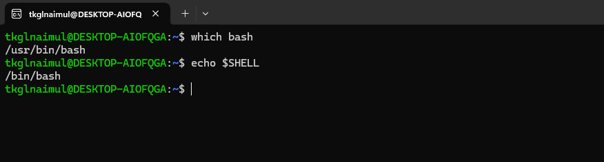

**File and Directory Operations**

* Create a directory named **linux\_fundamentals** in your home directory.  
* Inside **linux\_fundamentals**, create a subdirectory named **scripts**.  
* Create an empty file named **example.txt** inside the **linux\_fundamentals** directory.  
* Copy **example.txt** to the **scripts** directory.  
* Move **example.txt** from **linux\_fundamentals** to **linux\_fundamentals/backup**. 
  
  ```bash
    # Creates a new empty directory
    mkdir linux_fundamentals
    # Creates a new empty file
    touch example.txt
    # Copy the file to new directory
    cp example.txt scripts/
    # Move the file to new directory
    mv example.txt backup/
    # List the files inside subdirectory
    ls backup/
  ```
  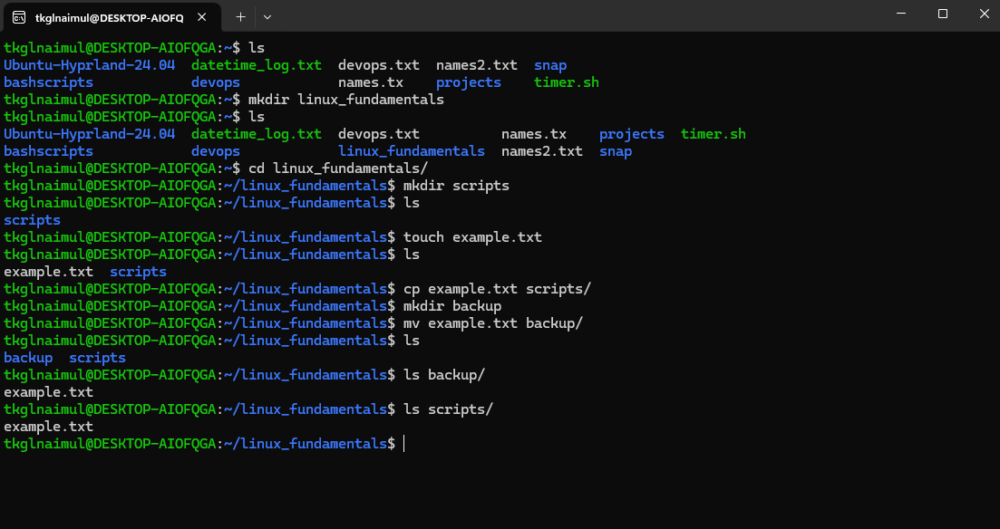

  **Permissions**  
* Change the permissions of example.txt to read and write for the owner, and **read-only** for the group and others.  
* Verify the permission changes using ls \-l
  
  ```bash
    # Change the permission of the file
    # 4 = read, 2 = write, 1 = executable, 0 = No
    # So 6 means read and write(4+2), 4 means readonly
    # 1st part 6 is for the user, 2nd part 4 is for group and 3rd part is for others
    chmod 644 example.txt
  ```
  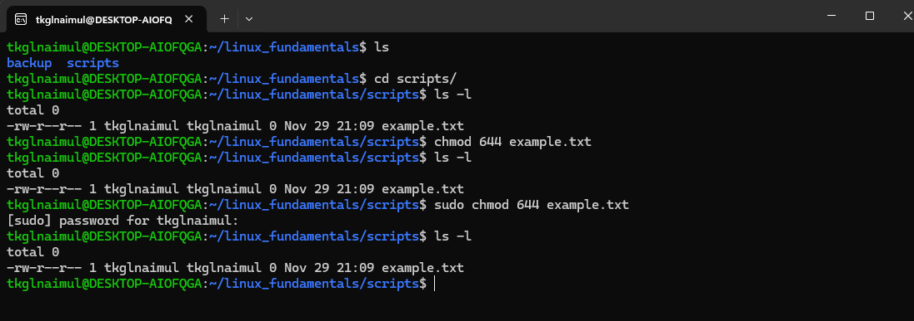

**File Modification**

* Create a file named **example.txt** in your home directory.  
* Change the owner of **example.txt** to a user named student  
* Change the group of **example.txt** to a group named students.  
* Verify the changes using appropriate commands.
  
  ```bash
    # Add new user student
    sudo useradd student
    # Set password for the user student
    sudo passwd student
    # View details of the user student. See all the users by cat /etc/passwd. 
    # Then pipe(|) grep to search the user matches the keyword student 
    cat /etc/passwd | grep student
    # Add new group students
    sudo groupadd students
    # Change the owner of the file example.txt to student
    sudo chown student example.txt
    # Change the group owner of the file example.txt to students
    sudo chgrp students example.txt
  ```
  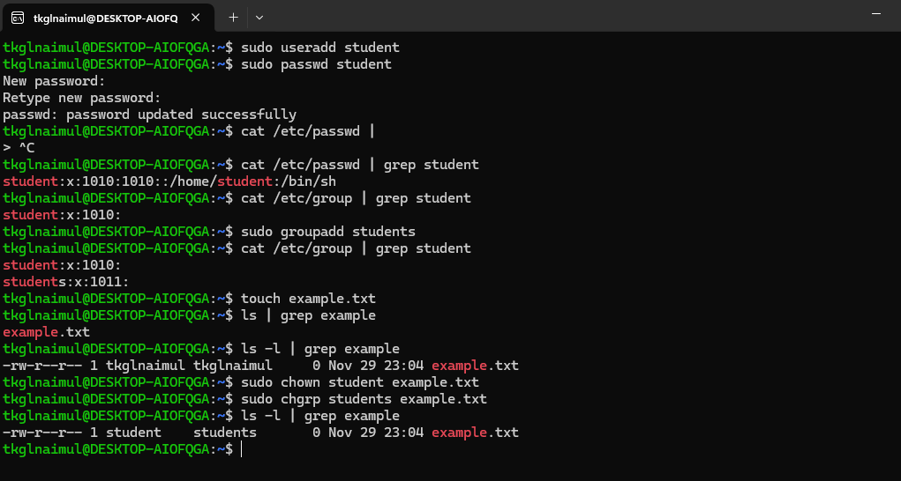

**Ownership**

* Create a directory named project in your home directory.  
* Create a file named **report.txt** inside the project directory.  
* Set the permissions of **report.txt** to read and write for the owner, and read-only for the group and others.  
* Set the permissions of the project directory to read, write, and execute for the owner, and read and execute for the group and others  
* Verify the changes using appropriate commands.
  
  
  ```bash
    # Show the current folder path
    pwd
    # Give permission to the report.txt file
    chmod 644 report.txt
    # Give permission to the project folder
    chmod 755 project
  ```
  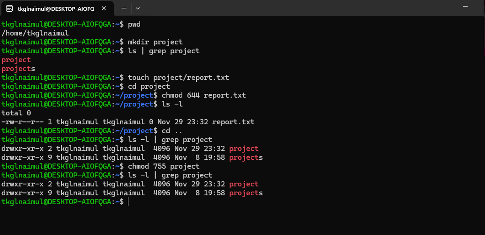

**User add/modify**

* Create a new user named developer.  
* Set the home directory of the user developer to /home/developer\_home.  
* Assign the shell /bin/sh to the user developer.  
* Verify the new user's information.  
* Change the username of the user developer to devuser.  
* Add devuser to a group named devgroup.  
* Set the password of devuser to devpass. ( hint: use passwd command. Run passwd \--help to see available options)  
* Verify the changes made to the user.
  
  ```bash
    # Create a new directory developer_home inside home directory
    sudo mkdir /home/developer_home
    # Set the home directory of the user developer to developer_home
    sudo usermod -d /home/developer_home -m developer
    # Assign the shell /bin/sh to the user developer
    sudo usermod -s /bin/sh developer
    # Change the username of the user developer to devuser.
    sudo usermod -l devuser developer
  ```
  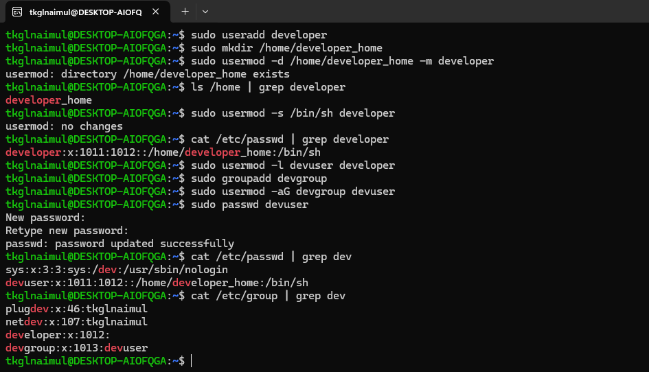

**Hard/Soft Link**

* Create a file named **original.txt** in your home directory.  
* Create a symbolic link named **softlink.txt** pointing to **original.txt**.  
* Verify the symbolic link and ensure it points to the correct file.  
* Delete the original file **original.txt** and observe the status of the symbolic link.  
* Create a file named **datafile.txt** in your home directory.  
* Create a hard link named **hardlink.txt** pointing to datafile.txt.  
* Verify the hard link and ensure it correctly points to the file.  
* Check the inode of both **datafile.txt** and **hardlink.txt**  
* Delete the original file **datafile.txt** and observe the status of the hard link.  
* Find all .txt files in your home directory. ( use find command. Run find \--help for usage)
  
   ```bash
    # Create a softlink of the file original.txt 
    ln -s ../original.txt softlink.txt
    # Create a hardlink of the file datafile.txt 
    ln ../datafile.txt hardlink.txt
    # Show the inode of a file 
    ls -i hardlink.txt
    # Find all the .txt files in the current directory
    find . -name "*.txt"
  ```
  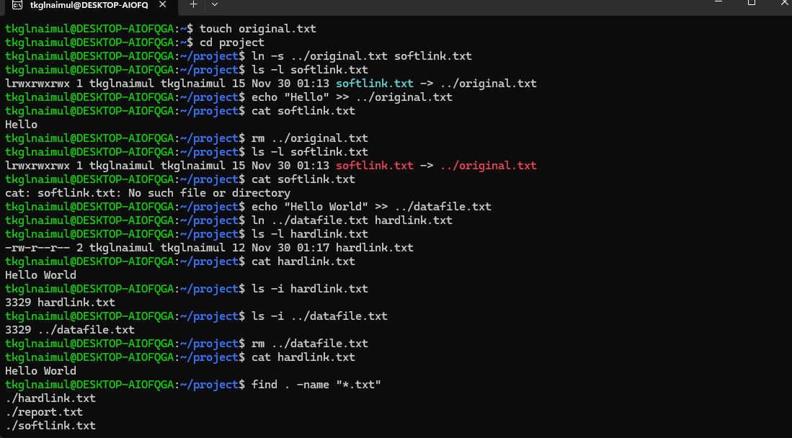

**Package installation**

* Update repo cache using apt/apt-get  
     ```bash
    # Update repo cache 
    sudo apt update
  ```
  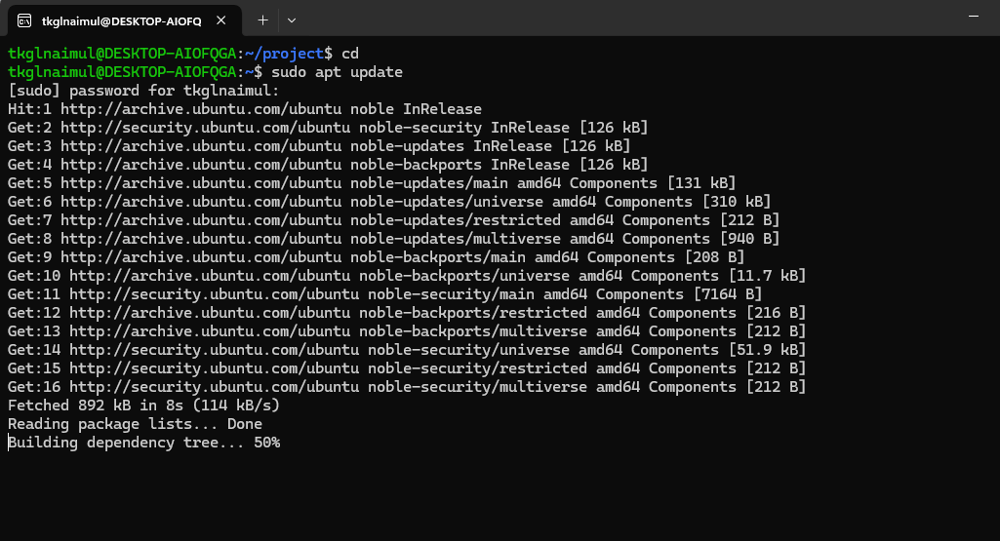
  
* Install a package named **tree**  
* Install gcloud CLI tool using apt ( Follow instructions from here: [https://cloud.google.com/sdk/docs/install\#deb](https://cloud.google.com/sdk/docs/install#deb) )
  
  ```bash
    # tree and gloud CLI installed
  ```
  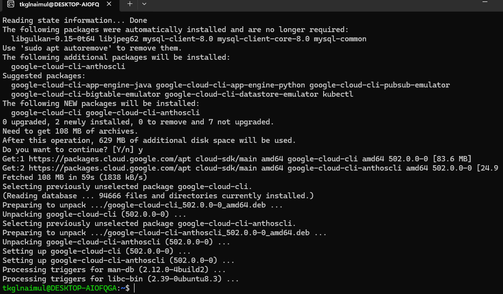

# instruction for running all the commands from a single file
```bash
    # Clone the repo
    git clone https://github.com/naimul-ferdous/linux-fundamentals.git
    # Change the directory to linux fundamentals
    cd linux-fundamentals
    # Make the file executable
    chmod +x linux_fundamentals.sh
    # Run the executable file
    ./linux_fundamentals.sh
```

